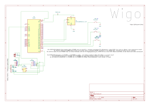

# Wigo
# WIGO 🚀

**WIGO — 1 устройство. ∞ игр.**

WIGO — это DIY-IoT устройство (портативная консоль), которое объединяет множество настольных игр в одном компактном корпусе на базе контроллера **ESP32** и OLED-дисплея.

An open-source ESP32-based portable IoT console for board games.

---

## 🔌 Wiring Schematic / Схема подключения

---

## ⚠️ Important Warnings / Важные предупреждения

### 🇷🇺 Русский
* **МОДУЛИ ПИТАНИЯ:** Компоненты J1 (TP4056) и J2 (MT3608) на схеме — это готовые китайские модули для сборки, а не голые чипы!
* **НАСТРОЙКА НАПРЯЖЕНИЯ:** Отрегулируйте модуль MT3608 строго на выход **5V** с помощью мультиметра **ДО** подключения к плате ESP32. Если этого не сделать, плата моментально сгорит!

### 🇺🇸 English
* **POWER MODULES:** Components J1 (TP4056) and J2 (MT3608) are ready-made breakout modules, not bare IC chips!
* **VOLTAGE CALIBRATION:** Adjust the MT3608 module strictly to **5V** output using a multimeter **BEFORE** connecting it to the ESP32 board, otherwise the board will burn instantly!

### 🇩🇪 Deutsch
* **STROMMODULE:** Die Komponenten J1 (TP4056) und J2 (MT3608) sind fertige Entwicklungsmodule und keine nackten IC-Chips!
* **SPANNUNGSREGLUNG:** Stellen Sie das MT3608-Modul mit einem Multimeter strikt auf **5V** Ausgangsspannung ein, **BEVOR** Sie es an das ESP32-Board anschließen, da das Board sonst sofort durchbrennt!

---

## 🛠 Hardware Components / Компоненты
* **MCU:** ESP32 (NodeMCU-32S)
* **Display:** OLED 0.96" I2C (128x64)
* **Battery Charge:** TP4056 Module
* **Step-Up Converter:** MT3608 Module
* **Resistors:** 2x 100 kΩ (Battery Monitor / Измерение заряда на IO35)

---

## 💻 Software & Firmware / Прошивка

* 🇷🇺 **Текущий этап:** Устройство полностью спроектировано, прошивка находится **в активной разработке**. Код будет опубликован сразу после завершения тестирования базовых игр.
* 🇺🇸 **Current Status:** Hardware design is complete. Firmware is **under active development** and will be published as soon as core game testing is finished.

---

## 📱 Telegram Channel / Наш канал

Следите за разработкой консоли в реальном времени по тегу `#Wigo@IfElseLolhez`!

[![Telegram Channel(https://t.me/IfElseLolhez)
